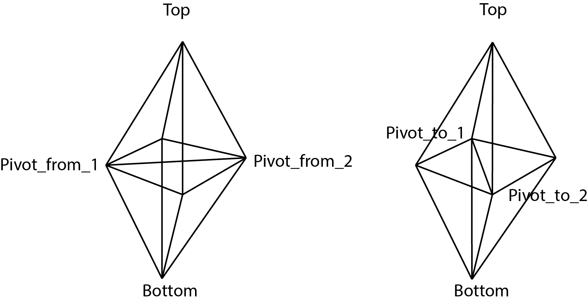

# bistellar-flip

Bistellar flip proposal for [CGAL].

## Description

A bistellar flip operates on 4 cells in a 3-dimensional [Triangulation_data_structure].

The *pivot edge* is the edge that is common to all 4 cells (obtained via a [Circulator]).
It's endpoints are *Pivot_from_1* and *Pivot_from_2*.

The *new pivot edge* is the edge that will be common to the 4 new cells.
It's endpoints are *Pivot_to_1* and *Pivot_to_2*, obtained by selecting the 2 vertices
of the 6 comprising the 4-cell complex that are not the *Top*, *Bottom*, *Pivot_from_1*,
or *Pivot_from_2* vertices.

Here are the 4 old cells defined by the vertices labelled in the figure:

| Cell         | Vertices                                               |
|--------------|--------------------------------------------------------|
| **before_1** | *Top*, *Pivot_from_1*, *Pivot_from_2*, *Pivot_to_1*    |
| **before_2** | *Top*, *Pivot_from_1*, *Pivot_from_2*, *Pivot_to_2*    |
| **before_3** | *Bottom*, *Pivot_from_1*, *Pivot_from_2*, *Pivot_to_1* |
| **before_4** | *Bottom*, *Pivot_from_1*, *Pivot_from_2*, *Pivot_to_2* |

And here are the 4 new cells:

| Cell         | Vertices                                             |
|--------------|------------------------------------------------------|
| **after_1**  | *Top*, *Pivot_from_1*, *Pivot_to_1*, *Pivot_to_2*    |
| **after_2**  | *Top*, *Pivot_from_2*, *Pivot_to_1*, *Pivot_to_2*    |
| **after_3**  | *Bottom*, *Pivot_from_1*, *Pivot_to_1*, *Pivot_to_2* |
| **after_4**  | *Bottom*, *Pivot_from_2*, *Pivot_to_1*, *Pivot_to_2* |

We also must obtain the neighbors of the 4 old cells, and assign them appropriately to the 4 new cells.
[CGAL] indicates neighbors by a cell and the index of the vertex opposite the neighboring cell.
The four cells form an octohedron, so there are 8 neighbors, as follows:

| Neighboring cell | Cell         | Vertex opposite |
|------------------|--------------|-----------------|
| **n_1**          | **before_1** | *Pivot_from_2*  |
| **n_2**          | **before_1** | *Pivot_from_1*  |
| **n_3**          | **before_2** | *Pivot_from_1*  |
| **n_4**          | **before_2** | *Pivot_from_2*  |
| **n_5**          | **before_3** | *Pivot_from_2*  |
| **n_6**          | **before_3** | *Pivot_from_1*  |
| **n_7**          | **before_4** | *Pivot_from_1*  |
| **n_8**          | **before_4** | *Pivot_from_2*  |

We then assign neighbors to the 4 new cells:

| New cell    | Neighboring cells                          |
|-------------|--------------------------------------------|
| **after_1** | **n_1**, **n_4**, **after_2**, **after_3** |
| **after_2** | **n_2**, **n_3**, **after_1**, **after_4** |
| **after_3** | **n_5**, **n_8**, **after_1**, **after_4** |
| **after_4** | **n_6**, **n_7**, **after_2**, **after_3** |

The assignment of neighbors to the new cells should complete the bistellar flip.

The last thing to do is to check that there are no orientation issues in the new cells.
If there are, *tds().reorient()* is called on the triangulation (would be nice if this
could be done on just the cell complex, but [reorient] is called on the entire triangulation,
and is currently implemented in terms of the local function [change_orientation], which does
operate on individual cells and would be useful if exposed).

## Implementation

There are several helper functions which take a (Delaunay) triangulation as an argument,
but would be probably be better implemented and exposed in the [Triangulation_data_structure].

- [get_finite_cells]
- [get_finite_edges]

Returning [ranges] instead of containers would also be useful.

These functions return [std::optional] as a result is not necessarily guaranteed:

- [find_pivot_edge]
- [get_incident_cells]
- [bistellar_flip]

It might be useful to return as [std::expected<T,E>] whenever that is widely available.

[CGAL]: https://www.cgal.org/
[Triangulation_data_structure]: https://doc.cgal.org/latest/TDS_3/index.html
[Circulator]: https://doc.cgal.org/latest/Circulator/classCirculator.html
[reorient]: https://doc.cgal.org/latest/TDS_3/classTriangulationDataStructure__3.html#af501f165455a2411543d6ec2542fea8d
[change_orientation]: https://github.com/CGAL/cgal/blob/8430d04539179f25fb8e716f99e19d28589beeda/TDS_3/include/CGAL/Triangulation_data_structure_3.h#L1666
[std::optional]: https://en.cppreference.com/w/cpp/utility/optional
[std::expected<T,E>]: https://en.cppreference.com/w/cpp/header/expected
[ranges]: https://en.cppreference.com/w/cpp/ranges
[find_pivot_edge]: https://github.com/acgetchell/bistellar-flip/blob/master/include/bistellar_flip.hpp#L72
[get_incident_cells]: https://github.com/acgetchell/bistellar-flip/blob/master/include/bistellar_flip.hpp#L125
[bistellar_flip]: https://github.com/acgetchell/bistellar-flip/blob/master/include/bistellar_flip.hpp#L167
[get_finite_cells]: https://github.com/acgetchell/bistellar-flip/blob/master/include/bistellar_flip.hpp#L39
[get_finite_edges]: https://github.com/acgetchell/bistellar-flip/blob/master/include/bistellar_flip.hpp#L54

